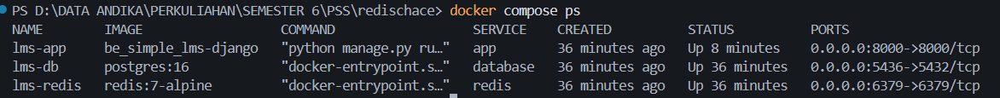
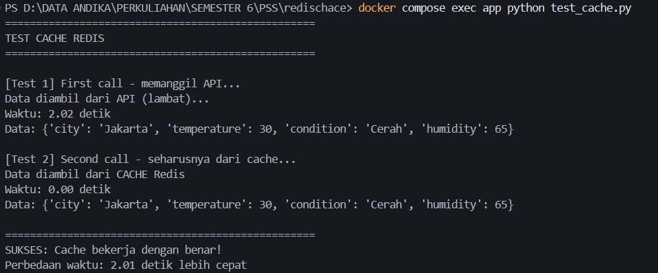
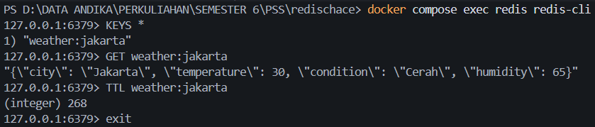

# Laporan Praktikum: Caching API dengan Redis

**Mata Kuliah:** Pemrograman Sisi Server (PSS)  
**Topik:** Implementasi Caching Sederhana Menggunakan Redis untuk Menyimpan Hasil API Call

---

## Bagian 1: Kode Program

### Kode Awal (Sebelum Ada Cache)

```python
# weather_api.py - KODE INI SUDAH DIBERIKAN
import requests
import time

def get_weather(city):
   """Simulasi API call yang lambat"""
   time.sleep(2)  # Simulate slow API
   response = requests.get(f"https://api.example.com/weather/{city}")
   return response.json()

# Problem: Setiap panggil get_weather() butuh 2 detik
# Solution: Cache hasilnya di Redis selama 5 menit
```

### Kode Akhir (Sudah Pakai Redis Cache)

```python
import time
import json
import redis

# Koneksi ke Redis
r = redis.Redis(
    host='redis',
    port=6379,
    db=0,
    decode_responses=True
)

def get_weather(city):
    cache_key = f"weather:{city.lower()}"

    # GET - cek cache dulu
    cached_data = r.get(cache_key)
    if cached_data:
        print("Data diambil dari CACHE Redis")
        return json.loads(cached_data)

    # Jika tidak ada di cache, panggil API
    print("Data diambil dari API (lambat)...")
    time.sleep(2)

    weather_data = {
        "city": city,
        "temperature": 30,
        "condition": "Cerah",
        "humidity": 65
    }

    # SET - simpan data ke Redis
    r.set(cache_key, json.dumps(weather_data))

    # EXPIRE - set masa berlaku 5 menit (300 detik)
    r.expire(cache_key, 300)

    return weather_data
```

---

## Bagian 2: Perintah Redis yang Digunakan

| Command  | Penggunaan dalam Kode                        | Fungsi                                                                         |
| -------- | -------------------------------------------- | ------------------------------------------------------------------------------ |
| `GET`    | `r.get(cache_key)`                           | Mengambil data dari cache. Mengecek apakah data cuaca sudah tersimpan di Redis |
| `SET`    | `r.set(cache_key, json.dumps(weather_data))` | Menyimpan data cuaca ke Redis setelah berhasil dipanggil dari API              |
| `EXPIRE` | `r.expire(cache_key, 300)`                   | Mengatur masa berlaku data agar otomatis terhapus setelah 5 menit (300 detik)  |

---

## Bagian 3: Hasil Pengujian

### 3.1 Status Container Docker

Perintah yang dijalankan:

```bash
docker compose ps
```



### 3.2 Test Ping Redis

Perintah yang dijalankan:

```bash
docker compose exec redis redis-cli ping
```


### 3.3 Hasil Test Cache

Perintah yang dijalankan:

```bash
docker compose exec app python test_cache.py
```



### 3.4 Verifikasi Data di Redis

Perintah yang dijalankan:

```bash
docker compose exec redis redis-cli
KEYS *
GET weather:jakarta
TTL weather:jakarta
exit
```



---

## Bagian 4: Jawaban Pertanyaan

### 4.1 Kenapa response time berbeda?

Karena **first call** data belum ada di cache sehingga harus memanggil API dulu yang membutuhkan waktu 2 detik. Sedangkan **second call** data sudah tersimpan di Redis sehingga langsung diambil dari cache dan hanya butuh waktu 0.00 detik.

### 4.2 Apa keuntungan caching?

- Response time menjadi jauh lebih cepat
- Beban server API berkurang
- Biaya request ke API eksternal lebih hemat
- Aplikasi menjadi lebih responsif bagi pengguna

### 4.3 Kapan sebaiknya tidak menggunakan cache?

Cache sebaiknya **tidak** digunakan ketika:

- Data harus real-time, seperti harga saham atau skor pertandingan bola
- Data berubah sangat sering sehingga cache cepat tidak valid
- Data bersifat sensitif seperti password atau informasi rekening bank
- Memori server terbatas dan tidak mencukupi untuk menyimpan cache

---

## Penjelasan: Third Call After 5 Minutes

Setelah 5 menit, cache akan **expired** (terhapus otomatis oleh Redis). Sehingga sistem harus memanggil API lagi dan waktu respons akan kembali lambat sekitar 2 detik sama seperti first call.

---

## Kesimpulan

Implementasi caching dengan Redis berhasil mempercepat response time dari **2.02 detik** menjadi **0.00 detik**. Redis mudah diimplementasikan dengan perintah `GET`, `SET`, dan `EXPIRE`. Cache sangat berguna untuk data yang tidak sering berubah, namun tidak cocok untuk data real-time atau data sensitif.
